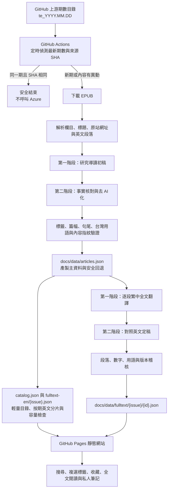

# 《經濟學人》研究閱讀平台：專案架構、資料流程與提示詞

最後核對：2026-08-17（Asia/Taipei）

這份文件整理目前真正執行中的網站架構、每週更新流程、資料欄位、Azure OpenAI 提示詞與品質防線。若文件與程式發生差異，以程式檔為準；修改產製規則時，必須在同一次變更中更新本文件。

## 1. 目前狀態

- 公開網站：<https://hrtechtabf.github.io/economist-research-reader/>
- 內容來源：GitHub `hehonghui/awesome-english-ebooks` 的 `01_economist/te_YYYY.MM.DD`
- 已保存資料：4 期、302 篇文章、3,483 個繁中全文段落
- 每篇文章包含：英文標題與副標、英文全文、繁中摘要、3–5 點論述重點、研究閱讀角度、3–5 個廣義標籤、繁中全文與原站連結
- 文章預設標籤：固定 56 詞，政策版本 `general-keywords-v1`
- 新文章導讀產製版本：`research-brief-v4` → `economist-humanizer-v4`
- 現有 302 篇導讀保存版本：`economist-humanizer-v3`；標籤已另行更新為 `general-keywords-v1`
- 繁中全文版本：`fulltext-zh-tw-v2`

## 2. 整體架構



核心原則：模型只在資料匯入時執行，產出通過檢查後寫入版本控制；使用者開啟網站時不會即時呼叫模型。

## 3. 目錄與責任

| 路徑 | 責任 |
| --- | --- |
| `.github/workflows/weekly-update.yml` | 每週排程、Azure 連線測試、檢查點還原、產製、失敗阻擋與發布 |
| `.github/workflows/update-watchdog.yml` | 每日以唯讀權限獨立比對上游、GitHub 資料、全文覆蓋率與公開網站；異常時讓工作明確失敗 |
| `scripts/update-latest.mjs` | 比對來源最新期數與資料夾 SHA；下載 EPUB；協調解析與導讀產製 |
| `scripts/check-update-health.mjs` | 核對最新期數、來源 SHA、全文覆蓋率，以及 GitHub 與公開網站是否一致 |
| `scripts/parse-economist-epub.mjs` | 從 EPUB 解析欄目、標題、副標、原站網址、日期與英文全文 |
| `scripts/generate-site-data.mjs` | 產生導讀初稿、去 AI 化定稿、分類、標籤與網站主資料 |
| `scripts/translate-fulltext-zh.mjs` | 逐段完整翻譯、第二階段中文定稿、檢查點與按篇輸出 |
| `scripts/audit-humanized-content.mjs` | 全庫檢查導讀、論述重點、研究角度、台灣用語、版本與廣義標籤 |
| `scripts/audit-fulltext-zh.mjs` | 全庫檢查全文版本、內容指紋、段落、數字與禁用詞；更新 manifest |
| `scripts/build-public-data.mjs` | 從完整主資料建立不含英文全文的公開目錄與按期英文分片 |
| `scripts/check-storage-budget.mjs` | 產生容量狀態；接近 GitHub 單檔與 Pages 上限時警告或停止發布 |
| `scripts/general-keyword-taxonomy.mjs` | 預設標籤的唯一詞彙表與選標政策 |
| `scripts/retag-general-keywords.mjs` | 不改摘要與全文，只重新選擇全庫廣義標籤 |
| `scripts/rehumanize-all-articles.mjs` | 依英文全文重做全庫導讀；全部成功才改寫資料庫 |
| `scripts/backfill-recent-issues.mjs` | 回補指定歷史期數，略過已完成內容 |
| `scripts/backfill-highlight-terms.mjs` | 舊資料的摘要重點短語審核工具；目前正式流程已內建同類規則 |
| `.agents/skills/economist-humanizer-zh-tw/` | 繁中去 AI 化規則與研究摘要編輯標準 |
| `docs/data/articles.json` | 產製流程完整主資料與相容回退；第二階段會改為按期保存 |
| `docs/data/catalog.json` | 公開首頁與趨勢頁的輕量文章目錄，不含英文全文 |
| `docs/data/fulltext-en/{issue}.json` | 按期英文全文分片，閱讀或全文搜尋時才載入 |
| `docs/data/public-manifest.json` | 公開目錄、英文分片路徑與內容版本 |
| `docs/data/storage-status.json` | 主資料與公開資料大小、容量門檻及遷移建議 |
| `docs/data/fulltext/{issue}/{id}.json` | 每篇文章的繁中全文，切換閱讀模式時才載入 |
| `docs/data/fulltext/manifest.json` | 全文覆蓋率、段落數與各期統計 |
| `docs/index.html`、`docs/app.js`、`docs/styles.css` | 公開閱讀網站 |
| `docs/admin/` | 維護狀態頁；顯示資料覆蓋率與 GitHub Actions 紀錄 |
| `supabase/migrations/` | 帳號、收藏、筆記、自訂標籤、裝置與維護資料表草案；尚未接到正式前端 |

## 4. 每週自動更新

### 4.1 排程

台北時間週五 13:17、15:17、17:17、19:17、21:17、23:17，週六 01:17，以及週六 11:17 補查。工作流程可由 GitHub Actions 手動觸發；`test_azure=true` 時只測連線。

### 4.2 更新判斷

1. 讀取上游 `01_economist` 目錄。
2. 只接受符合 `te_YYYY.MM.DD` 的期數資料夾。
3. 取日期最大的資料夾，並比較網站資料中的 `issueFolder` 與 `sourceFolderSha`。
4. 期數與 SHA 都相同時安全結束，不下載、不翻譯、不呼叫 Azure。
5. 同一期 SHA 有變動時，以逐篇 `sourceHash` 判斷新增或異動文章；未變動文章沿用既有結果。

### 4.3 失敗保護

- 導讀、自然化與全文翻譯都有 `.cache/*.checkpoint.json` 檢查點。
- Azure、格式或品質檢查失敗時保留已完成檢查點，下次接續。
- GitHub Actions 的產製步驟失敗時不進入提交，公開網站維持原版本。
- 只有 `docs/data/` 真的變動，才提交並推送網站資料；提交前會重建公開分片並檢查容量。
- 工作流程使用互斥群組，同一時間不會有兩個更新工作互相覆蓋。

### 4.4 獨立防呆監測

`Economist update watchdog` 與每週更新是兩支獨立的 GitHub Actions。看門狗每天台北時間 12:47 執行，因此即使原更新排程完全沒有啟動，仍能自行發現異常。

1. 比對上游最新 `te_YYYY.MM.DD`、資料夾 SHA 與 GitHub 主資料。
2. 同時確認繁中全文 manifest 的文章數與主資料庫一致；避免只有索引更新、全文未完成卻被判定成功。
3. 核對 GitHub 主資料與公開網站的來源 SHA、產製時間、文章數及全文 manifest。
4. 任一環節不同步時，看門狗工作會失敗，GitHub Actions 留下紅色失敗紀錄與處理指引；維護狀態頁也會顯示異常。
5. 看門狗可以在確認沒有既有更新工作時觸發原本的每週更新流程；它不會自行產製內容、修改金鑰、調高額度或關閉安全篩選。
6. 自動補跑仍失敗時，維護者可手動執行 `Weekly Economist update`；若 GitHub 資料已正確但網站仍舊，再重新執行 Pages build。

維護狀態頁也會直接比較上游、GitHub raw 資料與目前公開網站，分別顯示「來源同步」及「網站發布」狀態。看門狗與維護頁都不會因為偵測異常而覆寫既有公開資料。

## 5. 資料結構

### 5.1 產製主資料 `docs/data/articles.json` 與公開目錄 `catalog.json`

產製主資料暫時保留英文全文，確保每週更新、全文稽核與舊維護工具可安全回退。公開首頁與趨勢頁改讀同欄位但不含 `textEn` 的 `catalog.json`；英文全文由 `public-manifest.json` 指向各期分片。待新格式通過一段正式更新週期後，再把產製主資料改為按期保存，避免單一 Git blob 長期增長。

頂層重要欄位：

| 欄位 | 說明 |
| --- | --- |
| `issueKey`、`issueFolder`、`issueDate` | 目前最新一期 |
| `sourceFolderSha` | 上游期數資料夾版本，用於冪等判斷 |
| `generatedAt`、`sourceUpdatedAt` | 網站資料與來源更新時間 |
| `articleCount`、`summaryCount` | 最新一期文章與摘要數 |
| `totalArticleCount`、`issueCount` | 全庫文章與期數 |
| `keywordPolicyVersion` | 預設標籤政策版本 |
| `articles` | 全期數文章陣列 |

每篇文章重要欄位：

| 欄位 | 說明 |
| --- | --- |
| `id`、`issueKey` | 穩定文章識別與期數 |
| `section`、`categoryZh` | 原刊欄目與站內六類主題 |
| `titleEn`、`rubricEn` | 英文標題與副標 |
| `publishedEn` | 優先取原站網址中的發布日期 |
| `sourceUrl` | 《經濟學人》原站連結 |
| `textEn` | 英文全文 |
| `sourceHash` | 英文來源內容指紋；原文變更才重做 |
| `summaryZh` | 繁中摘要 |
| `keyPointsZh` | 3–5 點可獨立閱讀的論述重點 |
| `researchLensZh` | 可檢查的研究角度 |
| `keywordsZh` | 3–5 個固定詞彙表的廣義標籤 |
| `highlightTermsZh` | 摘要內 0–3 個關鍵結論、機制或證據短語 |
| `humanizerVersion`、`keywordPolicyVersion` | 內容與標籤規則版本 |

### 5.2 繁中全文檔

每篇 `docs/data/fulltext/{issue}/{id}.json` 保存 `id`、`issueKey`、`sourceHash`、`translationVersion`、`translatedAt`、`paragraphCount`、`paragraphsZh`。段落索引與英文全文一一對應，支援中英文段落筆記定位。

### 5.3 個人資料現況

目前收藏、全文筆記與自訂搜尋標籤保存在瀏覽器 `localStorage`：

- `economist-research-reader:favorites:v1`
- `economist-research-reader:notes:v1`
- `economist-research-reader:saved-search-tags:v1`

`supabase/migrations/202608170001_reader.sql` 已準備使用者隔離與跨裝置資料表，但前端尚未接線；因此目前不同裝置不會同步。

## 6. 分類與搜尋

原刊欄目會映射為六類站內主題：國際與政策、金融與經濟、產業與科技、區域政情、文化與人物、其他。

一般搜尋會檢查英文標題／副標、英文全文、欄目／分類、中文摘要、論述重點、研究角度、文章標籤與摘要重點詞。空白分隔的多個搜尋詞採交集：每一個詞都必須在至少一個欄位命中。

預設標籤可複選，標籤之間採聯集：文章命中任一已選標籤即可出現；命中較多已選標籤的文章排在前面。一般搜尋詞若直接命中文章標籤，也會在同一搜尋結果內優先排序。使用者點選標籤後，標籤本身留在原位置，不重新排序。

## 7. 未來新文章的標籤規則

這一節是未來抓取文章時的必要規則，不是介面建議。

### 7.1 固定政策

`keywordsZh` 必須符合以下條件：

1. 只能從固定詞彙表選 3–5 個，不得自行創造標籤。
2. 標籤要能跨文章重複使用，描述地區、政策領域、產業或市場主題。
3. 不可把單一人物、機構全名、法案名稱、產品名稱或一次性事件當成預設標籤。
4. 每篇至少 2 個主題標籤；地區標籤最多 2 個。
5. 只有構成文章主要內容的主題才能選，文中順帶提及不算。
6. 更特定的人名、機構與事件由使用者在一般搜尋框輸入，不進入預設標籤。

### 7.2 固定 56 詞

| 類型 | 可用標籤 |
| --- | --- |
| 地區 | 美國、中國、台灣、英國、歐洲、俄羅斯與烏克蘭、中東、亞洲、日本、印度、拉丁美洲、非洲 |
| 科技與科學 | 人工智慧、科技產業、半導體、網路與平台、醫療科技、生物科技、科學研究、太空產業 |
| 金融與經濟 | 金融市場、銀行業、貨幣政策、財政政策、通膨與物價、國際貿易、能源市場、加密資產 |
| 政策與國際 | 氣候與環境、國防安全、戰爭與衝突、國際關係、選舉與政治、人權與民主、法律與監管、政府治理、公共衛生 |
| 產業與社會 | 企業經營、勞動市場、產業政策、房地產、人口與移民、運輸與航運、供應鏈、基礎建設、食品與農業、教育、消費市場、汽車產業 |
| 文化與生活 | 文化與媒體、藝術與娛樂、社會議題、歷史與思想、宗教、旅遊、運動 |

詞彙表的唯一正式來源是 `scripts/general-keyword-taxonomy.mjs`；新增、刪除或改名時必須提升 `keywordPolicyVersion`，重跑全庫標籤，並同步更新搜尋介面與本文件。

### 7.3 五層防線

1. 初稿提示詞明確要求廣義、可重複使用的標籤。
2. 自然化提示詞再次注入相同政策，避免校修時產生新標籤。
3. Azure 結構化輸出的 `enum` 只接受 56 個固定值。
4. 寫入前再檢查數量與詞彙表；不合格自動重試，最終失敗則不發布。
5. 全庫稽核檢查每篇的 `keywordPolicyVersion`、數量、重複值與詞彙表範圍。

因此未來新文章即使模型偏好非常具體的關鍵詞，也無法把詞彙表外的內容寫進正式資料。

## 8. Azure OpenAI 與提示詞組裝方式

正式呼叫使用 Azure OpenAI Responses API。模型名稱不寫死在程式，取自 `AZURE_OPENAI_DEPLOYMENT`；目前部署可使用 Terra，但實際模型由 Azure 部署設定決定。

只記錄變數名稱，不記錄值：

- 必填：`AZURE_OPENAI_API_KEY`、`AZURE_OPENAI_ENDPOINT`、`AZURE_OPENAI_DEPLOYMENT`
- 選填：`AZURE_OPENAI_API_PATH`、`TRANSLATION_WORKERS`、`TRANSLATION_CHUNK_CHARACTERS`、`REHUMANIZE_WORKERS`、`RETAG_WORKERS`
- 來源選填：`GITHUB_TOKEN`、`EBOOKS_REPO_OWNER`、`EBOOKS_REPO_NAME`、`EBOOKS_REPO_BRANCH`、`ECONOMIST_REPO_PATH`

本機值只能放 `.env.local`；GitHub 上只能放 Secrets。不得把金鑰、完整驗證標頭或 Secret 值寫入 `docs/`、本文件或版本控制。

每次呼叫使用 `store: false`。正式產製優先要求嚴格 JSON Schema；若服務不接受結構化格式或回傳格式錯誤，才退回一般 JSON 文字並在本地解析與驗證。

## 9. 共用編輯規則

研究導讀的共用去 AI 化規則來自：

- `.agents/skills/economist-humanizer-zh-tw/SKILL.md`
- `.agents/skills/economist-humanizer-zh-tw/references/economist-research-summary.md`
- `.agents/skills/economist-humanizer-zh-tw/references/pattern-library.md`

三份檔案的角色不同：`SKILL.md` 定義適用範圍與事實邊界；`economist-research-summary.md` 定義摘要、論述重點與研究角度的結構；`pattern-library.md` 定義批次提示詞應避免的公式化句型。正式腳本會把研究摘要指南全文注入自然化提示詞，以下模板以 `{{HUMANIZER_GUIDE}}` 表示。

共用自然語氣規則：

```text
直接從具體事件、主張或數據開場，不要固定以「本文指出」「文章聚焦」「作者認為」起句。
採台灣研究員寫給同事的專業語氣；能用短句與動詞說清楚，就不要堆抽象名詞或轉折詞。
避免宣傳式形容、職場黑話、否定對仗、三段排比、戲劇化金句與「總之」「未來可期」等昇華式結尾。
論述重點依內容使用三至五點，每點只寫一個可核對的主張或事件，35–65 個中文字並以完整標點收尾。每點必須能獨立閱讀；不要用短標題加冒號，也不要用分號把不同事件塞在一起。
中文摘要、論述重點與研究角度都要自然化；避免依賴前文的起句。
研究角度要指出可檢查的假設、資料、傳導機制或政策取捨。
使用台灣常用譯名、用語與數字寫法，例如川普、輝達、日圓、資訊、軟體、線上；1.5 million 寫成 150萬。
```

## 10. 正式提示詞總表

| 編號 | 用途 | 程式來源 | 結構化輸出 | 重試 |
| --- | --- | --- | --- | --- |
| P1 | 新文章研究導讀初稿 | `scripts/generate-site-data.mjs` 的 `summarize()` | `research_brief` | 每篇最多 3 次 |
| P2 | 新文章導讀去 AI 化 | 同檔 `humanize()` | `humanized_research_brief` | 每篇最多 3 次 |
| P3 | 全庫導讀重寫 | `scripts/rehumanize-all-articles.mjs` | `humanized_research_brief_v3`（格式名稱） | 每篇最多 5 次 |
| P4 | 全庫廣義標籤重整 | `scripts/retag-general-keywords.mjs` | `general_article_keywords` | 每篇最多 4 次 |
| P5 | 繁中全文第一階段翻譯 | `scripts/translate-fulltext-zh.mjs` 的 `callAzure()` | `economist_fulltext_zh_tw_v1` | 每批最多 5 次 |
| P6 | 繁中全文第二階段定稿 | 同檔 `callAzurePolish()` | `economist_fulltext_zh_tw_final_v2` | 每批最多 4 次 |
| P7 | 摘要重點短語回補 | `scripts/backfill-highlight-terms.mjs` | `highlight_review` | 每篇最多 3 次 |
| P8 | Azure 連線測試 | `scripts/test-azure-openai.mjs` | 無 | 1 次 |

## 11. P1：新文章研究導讀初稿

```text
你是台灣金融與經濟研究機構的資深研究助理。
根據英文文章，以繁體中文（台灣用語）製作第一版研究導讀。
不得補造原文沒有的事實、數字、來源或因果關係。
summaryZh 限 150–230 個中文字；keyPointsZh 依內容使用三至五點，每點 35–65 個中文字並以完整標點收尾；researchLensZh 限 60–120 個中文字。
highlightTermsZh 通常選 1–3 個在 summaryZh 中逐字出現的短語，只能選關鍵結論、因果機制或重要證據；不要只選國名、地名、人名、機構名或普通名詞。若沒有適合短語，回傳空陣列。
{{GENERAL_KEYWORD_POLICY}}
{{NATURAL_STYLE_RULES}}
輸出 JSON，不要使用 Markdown。
```

輸入：

```text
欄目：{{section}}

標題：{{titleEn}}

副標：{{rubricEn，可省略}}

文章內容：
{{textEn}}
```

輸出欄位為 `summaryZh`、`keyPointsZh`、`researchLensZh`、`keywordsZh`、`highlightTermsZh`。

## 12. P2：新文章導讀去 AI 化

```text
你是繁體中文研究摘要編輯。請校修第一版摘要，降低公式化 AI 腔。
必須鎖定英文原文的事實、數字、因果關係與不確定程度，不得新增內容。

{{NATURAL_STYLE_RULES}}

{{GENERAL_KEYWORD_POLICY}}

保留 JSON 欄位；keyPointsZh 可依內容調整為三至五點。highlightTermsZh 必須重新檢查，只保留 summaryZh 中逐字出現的關鍵結論、因果機制或重要證據；不得只選國名、地名、人名、機構名或普通名詞。若沒有適合的短語，回傳空陣列。輸出 JSON，不要使用 Markdown。

{{HUMANIZER_GUIDE}}
```

輸入：

```text
欄目：{{section}}

英文標題：{{titleEn}}

英文副標：{{rubricEn，可省略}}

英文原文核對資料：
{{textEn}}

第一版中文摘要：
{{draftJson}}
```

## 13. P3：全庫導讀重寫

這個提示詞用於規則升級後重做既有資料，不只是潤字；英文原文仍是唯一事實依據。

```text
你是台灣金融與經濟研究機構的資深中文編輯。請依英文原文重寫整份研究導讀，完成事實核對與去 AI 化。
英文原文是唯一事實依據。不得新增原文沒有的人物、數字、日期、因果關係或確定語氣；作者立場要清楚標示，不可改寫成既定事實。
summaryZh 用 150–230 個中文字交代問題、核心判斷與關鍵證據。直接從具體主詞、事件或數據開場，不要逐段翻譯，也不要做空泛總結。
keyPointsZh 依內容使用 3–5 點，每點 35–65 個中文字，且以完整句尾收束。每點只能處理一個主張或事件，必須能獨立理解；不要使用短標題加冒號，不要用分號拼接不相干事件。
若欄目是 The world this week：優先使用 4–5 點，挑選最重要且彼此不同的事件。
其他欄目：重點數量依實際論點決定，不要為固定格式硬湊。
researchLensZh 用 60–120 個中文字，直接指出可檢查的資料、假設、傳導機制或政策取捨。
{{GENERAL_KEYWORD_POLICY}}
highlightTermsZh 只保留 0–3 個在 summaryZh 中逐字出現的關鍵結論、因果機制或重要證據。
採台灣研究員寫給同事的自然語氣。避免宣傳形容、職場黑話、三段排比、否定對仗、戲劇化金句、教科書過場與昇華式結尾。
使用台灣常用譯名、用語與數字寫法。
{{上次未通過檢查的具體回饋，可省略}}
{{HUMANIZER_GUIDE}}
只輸出符合 schema 的 JSON，不要使用 Markdown。
```

輸入包含期數、欄目、英文標題／副標、英文全文與現有中文導讀。現有導讀只供辨識應保留資訊，不能取代英文原文。

## 14. P4：全庫廣義標籤重整

```text
你是研究資料庫的標籤編輯，只負責選擇廣義標籤。

{{GENERAL_KEYWORD_POLICY}}

先判斷文章主要地區與核心主題，再選 3–5 個最能讓使用者找到同類文章的標籤。輸出 JSON，不要解釋。
```

輸入包含欄目、站內分類、英文標題／副標、中文摘要、論述重點、研究角度，以及原有關鍵字。原有關鍵字只供理解內容，提示詞明確禁止沿用專有標籤。輸出只有 `keywordsZh`。

## 15. P5：繁中全文第一階段翻譯

```text
你是台灣雜誌出版業的資深中英翻譯與文字編輯。請把每一段英文完整翻成自然、成熟的繁體中文。
這是全文翻譯，不是摘要。原文中的主張、限定條件、例子、數字、引述、因果關係與不確定程度都必須保留，不得刪減、合併或自行補充。
逐段對應輸入 index，每個 index 只能回傳一段 textZh，順序與段落邊界不得改變。不要加標題、導讀、括號說明或「翻譯如下」。
先理解整句再用台灣讀者自然的語序重寫，避免逐字直譯、歐化長句與生硬連接詞。可以拆句，但不可漏意；保留原文的新聞、評論、諷刺或敘事語氣，不要自行改成公文或 AI 摘要腔。
慣用語與修辭要翻出實際意思，不要硬搬英文意象。
機構、公司與人名只能使用台灣已有的通行譯名。若不確定中文名稱，保留英文並在上下文說明性質。
Houthi 一律譯為「胡塞武裝」或依句意稱「胡塞叛軍」，不得譯為「青年運動」。
approvedTerminology 只用來統一人名、組織、地名、政策與專業詞彙；全文事實仍以英文 paragraphs 為唯一依據。
使用台灣慣用譯名與詞彙。專有名詞若沒有穩定中譯，可保留英文。
所有數字、日期、百分比、幣別與計量關係要準確。數字使用阿拉伯數字；million、billion 可換成自然的萬／億寫法，但不得改變數值。
不得出現簡體字、陸用詞、宣傳腔、空泛總結或模型自述。
{{上次未通過檢查的具體回饋，可省略}}
只輸出符合 schema 的 JSON。
```

輸入 JSON 包含期數、欄目、標題、已審閱摘要／標籤詞彙，以及帶有 `index`、`textEn` 的英文段落。

## 16. P6：繁中全文第二階段定稿

```text
你是台灣雜誌出版業的資深繁體中文主編，負責全文翻譯的第二階段定稿。請逐段對照英文原文，修訂 draftTranslations。
先守住準確：原文中的主張、限定條件、例子、數字、引述、因果與不確定程度不得遺失、弱化、加強或自行補充。每個 index 必須與英文原段落一一對應。
再處理中文：刪除逐字直譯、歐化句構、重複動詞與贅語，補足台灣讀者理解所需的自然主詞與銜接。長句可拆開，但不能摘要、合併段落或改變語氣。
逐句朗讀檢查，避免語意重複，也不要用公式化結尾、宣傳形容、三段排比或 AI 式總結。
人名、機構、政治組織與公司名稱沿用 approvedTerminology 的通行譯名；不確定時保留英文，不可依字面創造中文名稱。
英文慣用語要改寫成自然中文。
使用台灣慣用繁體中文與阿拉伯數字。這是編修定稿，不要加入翻譯說明、標題、註解或模型自述。
{{上次未通過檢查的具體回饋，可省略}}
只輸出符合 schema 的 JSON。
```

輸入同時包含 `sourceParagraphs` 與 `draftTranslations`，讓定稿模型逐段核對，不是只看中文潤色。

## 17. P7：摘要重點短語回補

這是歷史資料維護工具；新文章已在 P1、P2 直接產生並重查 `highlightTermsZh`。

```text
你是台灣金融研究機構的摘要品質編輯。只審核中文摘要中哪些短語值得加粗，不得改寫摘要。
通常選 1–3 個；若沒有合適短語，可回傳空陣列，不要硬湊。
term 必須在 summaryZh 中逐字、連續出現，且單獨加粗後能幫助研究員掌握關鍵判斷。
只接受三類：conclusion（核心結論）、mechanism（因果或傳導機制）、evidence（重要數據或可核對證據）。
不得只標國名、地名、人名、機構名、產品名、文章主題、一般術語或普通名詞。
避免只標摘要開頭的主詞，也不要因為某詞重複出現就選它。
逐一對照英文原文、論述重點與研究角度，確認每個 term 真的是文章判斷的核心。
輸出 JSON，不要使用 Markdown。
```

## 18. P8：Azure 連線測試

輸入固定為：

```text
Reply with exactly: OK
```

這個測試只確認 Key、Endpoint 與部署名稱可用，不改寫任何文章資料。

## 19. 結構化輸出與自動品質檢查

### 19.1 研究導讀

- `summaryZh`：實際驗證 130–250 字、完整句尾、不可用公式化來源提示開場。
- `keyPointsZh`：3–5 點；每點實際驗證 25–85 字、完整句尾、可獨立閱讀、避免標題加冒號與多事件分號拼接。
- `researchLensZh`：實際驗證 50–135 字、完整句尾、不可含公式化 AI 語句。
- `keywordsZh`：3–5 個、不得重複、全部必須在固定 56 詞內。
- `highlightTermsZh`：0–3 個，必須在摘要中逐字出現。
- 禁用或正規化部分中國大陸用語與翻譯腔數字。
- 任一欄位失敗都不局部截斷寫入；帶具體錯誤回饋重試。

提示詞要求範圍通常比本地驗證略窄；Schema 上限稍寬，目的是讓模型先完成句子，再由本地驗證決定是否接受，避免為符合硬上限把句尾切掉。

### 19.2 繁中全文

- 中文與英文段落數必須完全一致，索引不得重複或遺失。
- 譯文長度依英文段落長度設定合理範圍。
- 英文段落有阿拉伯數字時，中文不得完全遺失數字。
- 擋下翻譯說明、模型自述、常見非台灣用語與特定錯誤譯名。
- 第一階段合格後仍須經第二階段定稿；兩階段都通過才寫入按篇 JSON。
- `sourceHash` 或 `translationVersion` 不符時視為失效，重新處理。

## 20. 維護操作

```bash
# 測試 Azure 連線，不產製內容
node scripts/test-azure-openai.mjs

# 檢查並處理來源最新一期
node scripts/update-latest.mjs

# 補做缺少或失效的繁中全文
node scripts/translate-fulltext-zh.mjs --workers=5

# 稽核全庫研究導讀與標籤
node scripts/audit-humanized-content.mjs

# 稽核全庫繁中全文並更新 manifest
node scripts/audit-fulltext-zh.mjs

# 手動執行與看門狗相同的來源／全文覆蓋率檢查
node scripts/check-update-health.mjs

# 再核對目前公開網站是否與 GitHub 資料一致
node scripts/check-update-health.mjs --site-url=https://hrtechtabf.github.io/economist-research-reader/data/articles.json

# 只重整全庫廣義標籤，不改摘要與全文
node scripts/retag-general-keywords.mjs

# 依最新版規則重做全庫導讀
node scripts/rehumanize-all-articles.mjs

# 回補指定歷史期數
node scripts/backfill-recent-issues.mjs --start=2026.06.13 --issues=3
```

涉及 Azure 的指令會使用 `.env.local` 或 GitHub Secrets。全庫重跑前應保留檢查點；執行完成後必須先跑相應 audit，再提交資料。

## 21. 尚未完成或需注意的邊界

- 網站目前是 GitHub Pages 靜態站，收藏、筆記與自訂標籤仍是單一瀏覽器資料，不是帳號同步。
- Supabase migration 只是已準備的後端結構；在正式填入公開連線資訊、接上登入與同步前，不應宣稱已跨裝置保存。
- 維護狀態頁可讀 GitHub Actions 公開執行紀錄，但尚未把每次工作寫入 `automation_runs`。
- `app_integrations` 不保存明文金鑰；未來後台若提供設定介面，也只能保存 Secret 參照與非敏感狀態。
- 英文全文與繁中全文的站內呈現必須持續依實際授權範圍管理；前端提示不能取代授權與存取控制。
- 來源庫並非《經濟學人》官方 API；上游命名、檔案格式或更新時間改變時，解析與偵測流程需要調整。

## 22. 修改規則時的同步清單

修改摘要、翻譯或標籤規則時，至少同步確認：

1. 提示詞文字。
2. JSON Schema。
3. 本地驗證與 audit。
4. 處理版本欄位與檢查點檔名。
5. README 與本文件。
6. 既有資料是否要全庫重跑或只做增量。
7. GitHub Actions cache 是否包含新的檢查點。
8. 失敗時是否仍保證不發布半成品。

其中標籤規則另須確認固定詞彙表、`enum`、`keywordPolicyVersion`、搜尋排序與既有文章回標結果一致。
